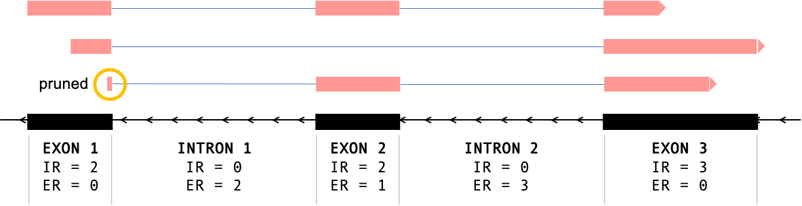

# PSI calculator
## About

This scripts calculates the percent spliced in (PSI) of different genomic features (exons and introns) from RNA-Seq data. 
It uses the PSI calculation as defined in [Schaffer et al., Curr. Protocols 2015](https://currentprotocols.onlinelibrary.wiley.com/doi/full/10.1002/0471142905.hg1116s87). 

## Dependencies

The script uses python's default modules (sys, os, collections, etc). The performance of other modules may be subjected to their version. 
The current script was tested using the following versions of these modules:
- Pysam 0.8.4
- HTSeq 0.6.0
- Pandas 0.23.3
## Usage
The script takes as input a sorted and indexed bam file, an annotation file (gtf format), and the name of the output file. 

```
Usage: e.g. 
	 python PSI_calculator.py -b <file.bam> -a <annotation.gtf> -p <output_file>

"PSI (Percent Spliced In) calculation of RNA-Seq data.

Options:
  -h, --help            show this help message and exit
  -b INPUT_BAM, --input_bam=INPUT_BAM
                        input bam file, sorted and indexed
  -a MA_ANNOTATION, --annotation_macro_exon=MA_ANNOTATION
                        annotation file (gtf format)
  -p OUTPUT_PREFIX, --out_prefix=OUTPUT_PREFIX
                        prefix for intermediate and output files
  --overhang=OVERHANG   min length of read mapping to flanking exons in a
                        junction [Default = 8]
  --min_intron=MIN_INTRON_LENGTH
                        [Default = 30]
  --max_intron=MAX_INTRON_LENGTH
                        [Default = 500,000]
  --strandedness=STRANDEDNESS
                        [Default = fr-firststrand]
  --micro_exon_length=MICRO_EXON_LENGTH
                        Cutoff for defining micro-exons [Default = 20]
 ```
 
 The options for strandedness are fr-firststrand (second pair is sense to the mRNA), fr-secondstrand (first pair is sense to the mRNA), and fr-unstrand (not strand specific).
 
 ### Annotation file
 The script calculates PSI for the genomic features defined in the GTF file e.g.
 ```
 chr1   ENSEMBL intron    9683100 9683200 .       +       .       gene_id "ENSG00000238411.1"; transcript_id "ENSG00000238411.1"; intron_number 2;
 chr1   ENSEMBL exon      9683200 9683300 .       +       .       gene_id "ENSG00000238411.1"; transcript_id "ENSG00000238411.1"; exon_number 3;
 chr1   ENSEMBL intron    9683300 9683400 .       +       .       gene_id "ENSG00000238411.1"; transcript_id "ENSG00000238411.1"; intron_number 3;
 ```
 The scripts uses the entire attribute column (column 9) as an identifier for the feature (exon or intron). 
 Customized GTF files must include the first 8 columns + a feature ID column.
 
 P.S. The script will only calculate the PSI of introns if they are annotated in the GTF file. The script can not infer the intron coordinates by itself. 
 
 ### Output file
 The output file is formated as follows 
 
 ```
 Segment_coordinates   Length Inclusion Exclusion  PSI  Part_type  Part_ID
 chr1:9683100:9683200:+   100       2        150    0.01    intron     gene_id "ENSG00000238411.1"; transcript_id "ENSG00000238411.1"; intron_number 2;
 chr1:9683200:9683300:+   100       100       20    0.72    exon       gene_id "ENSG00000238411.1"; transcript_id "ENSG00000238411.1"; exon_number 3;
 chr1:9683300:9683400:+   100       1        128    0.01    intron     gene_id "ENSG00000238411.1"; transcript_id "ENSG00000238411.1"; intron_number 3;
 ```
 Inclusion and Exclusion refer to the count of inclusion and exclusion reads respectively. If these values are 0 then PSI gets assigned the 'nan' value. 
 
 ## Older versions
 
 There are some significant changes ccompared to the older versions of this script. 
 - The current version does not need a *Settings* file anymore as the parameters **overhang**, **min_intron**, and **max_intron** are included as optional arguments of the scripts (needs not to be changed for most samples)
 - Micro and macro exons need not to be split into different GTF files anymore. The script will detect micro-exons from the annotation file (based on the **--micro_exon_length option**) and will calculate its PSI accordingly. 
 

## How it works
The script will parse every read in the bam file and check its overlap with the features from the GTF file. 
- An inclusion read (IR) is a read that significantly overlaps the genomic feature (overlap > overhang length which is 8 bases by default) or if the overlapping read block is an internal one e.g. The first read in **Figure 1** has three alignment blocks (aligning to three exons), the internal block is the middle one. 
- In **Figure 1**, the first block of the third read is excluded as it does not significanlt overlap Exon 1. 
- If the genomic feature is a micro-exon (shorter than 20 bases), then only internal alignment is considered for inclusion reads. 
- An exclusion read (ER) is a read whose skipped region fully contains the genomic feature. In **Figure 1** the third read's first junction does not count as an exclusion read for Intron 1 as the overlap for one of the flanking exons is not significant. 



The PSI is then calculated as follows:

 

 

 


## Further notes
- Secondary reads, supplementary reads, and discordant pairs are excluded from the calculation. Single-End reads are excluded from the last filter. 
- Consider changing the overhang value if the reads are short (less than 100 bases)
- Most RNA-Seq datasets are *fr-firststrand*, however make sure you check the strandedness of your data or select *fr-unstrand*
- Please reach out if you run into any issues


